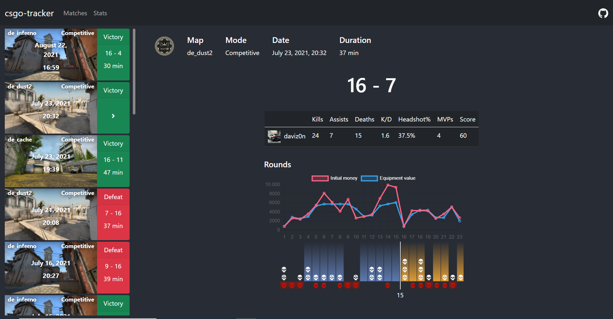
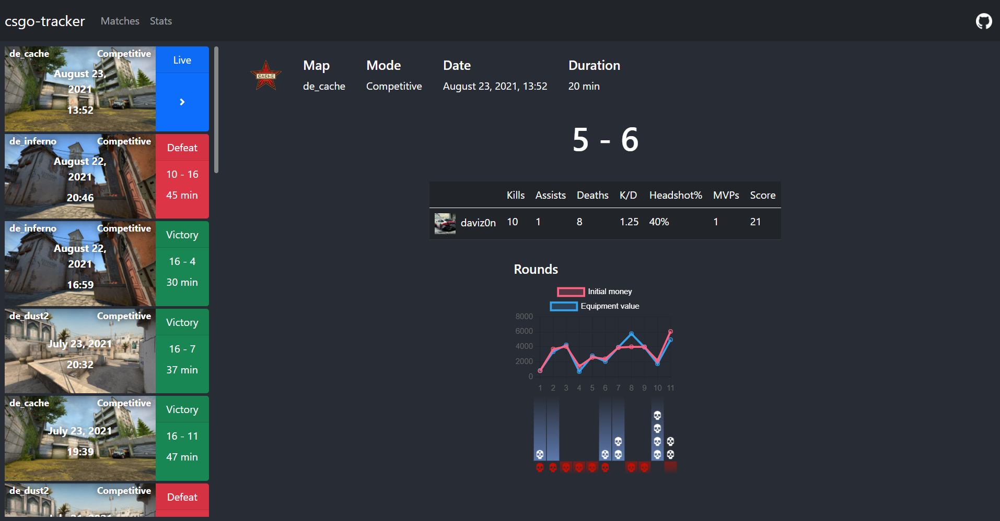

# csgo-tracker

csgo-tracker is a simple node.js app that lets you track your CS:GO matches and stats using [Valve's game state integration](https://developer.valvesoftware.com/wiki/Counter-Strike:_Global_Offensive_Game_State_Integration).

## Features
- Keep track of your CS:GO stats and matches.
- Get real time updates about your performance in the current match.
- No ads, no account needed, everything is stored locally.

